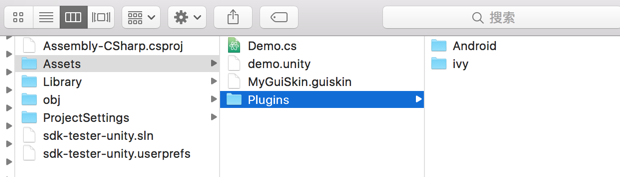
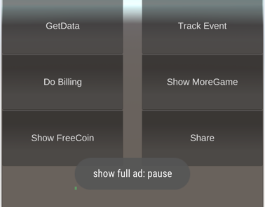

# RiseSDK for Unity3D

## 1, Add dependencies
Copy the folder named Plugins into your Unity3D project Assets folder


* if you use proguard to obfuscate your java source code, you should add these rules to your proguard rules file:
```java
-keep class com.risesdk.client.** {
    <methods>;
}

-keep class android.support.** {
    *;
}

-keep class com.risecore.async.** {
    public *;
}

-keep class com.risecore.common.** {
    public *;
}

-keep class com.risecore.network.** {
    public *;
}

-keep class com.risecore.view.** {
    public *;
}
```

## 2, Initialize
Call the Init function in a gameObject's Awake function in your initialize scene
```csharp
void Awake() {
  RiseSdk.Instance.Init();
  // when you want to use IAP or reward ad
  // then you should define this function
  // see step 4 and 5
  InitListeners();
}
```

## 3, ADs
This module will make these things done:
* show banner
* close banner
* show full screen ad
* make the player to share the game to his friends
* let the player to give your game a 5-star-rating
* track the player's behaviors for analytics

* Call the functions in need
```csharp
// show start ad when you want
RiseSdk.Instance.ShowAd(RiseSdk.M_START);

// show pause ad when you want
RiseSdk.Instance.ShowAd(RiseSdk.M_PAUSE);

// show custom ad when you want
RiseSdk.Instance.ShowAd(RiseSdk.M_CUSTOM);

// show banner in the bottom center position of your phone
RiseSdk.Instance.ShowBanner(RiseSdk.POS_BANNER_MIDDLE_BOTTOM);

// close banner
RiseSdk.Instance.CloseBanner();

// exit game
RiseSdk.Instance.OnExit();

// ask the player to give your game a 5 stars rating
RiseSdk.Instance.Rate ();

// ask the player to share your game with his friends
RiseSdk.Instance.Share();

// show more game to the player
RiseSdk.Instance.ShowMore();

// track events
RiseSdk.Instance.TrackEvent ("your category", "your action", "your label", 1);

// get server data for your game if needed
string data = RiseSdk.Instance.GetExtraData ();
```
* Notice
POS_BANNER* and M_* are defined in namespace RiseSdk
you should NOT define these again
```csharp
//position for showBanner
public const int POS_BANNER_LEFT_TOP = 1;
public const int POS_BANNER_MIDDLE_TOP = 3;
public const int POS_BANNER_RIGHT_TOP = 6;
public const int POS_BANNER_MIDDLE_MIDDLE = 5;
public const int POS_BANNER_LEFT_BOTTOM = 2;
public const int POS_BANNER_MIDDLE_BOTTOM = 4;
public const int POS_BANNER_RIGHT_BOTTOM = 7;

// tag for showAd
public const string M_START = "start";
public const string M_PAUSE = "pause";
public const string M_PASSLEVEL = "passlevel";
public const string M_CUSTOM = "custom";
```

## 4, In-App billing
* When you want to use google checkout, then you should do this:
```csharp
void InitListeners() {
  RiseSdkListener.OnPaymentEvent -= OnPaymentResult;
  RiseSdkListener.OnPaymentEvent += OnPaymentResult;
}

void OnPaymentResult(int resultCode, int billId) {
		switch (resultCode) {
		case RiseSdk.PAYMENT_RESULT_SUCCESS:
			switch (billId) {
			case 1:// the first billing Id success
				break;
			case 2:// the second billing Id success
				break;
			case 3:
				break;
			}
			Debug.LogError("On billing success : " + billId);
			break;

		case RiseSdk.PAYMENT_RESULT_FAILS:
			switch (billId) {
			case 1:
				break;
			}
			Debug.LogError("On billing failure : " + billId);
			break;

		case RiseSdk.PAYMENT_RESULT_CANCEL:
			break;
		}
}
```

* then call Pay function to launch payment flow
```csharp
RiseSdk.Instance.Pay(billId);
```

## 5, Reward Ads
Reward Ad is a video ad that when the player saw it, you will give him some golds/items/diamonds etc.

* when you want to use reward ad, then you should do:
```csharp
void InitListeners() {
  RiseSdkListener.OnRewardAdEvent -= GetFreeCoin;
  RiseSdkListener.OnRewardAdEvent += GetFreeCoin;
}

void GetFreeCoin (bool success, int rewardId){
		if (success) {
			switch(rewardId) {
			case 1:
				// you can add random golds, eg. 10
				//player.gold += 10;
				break;
			}
			Debug.LogError ("success: free coin: " + rewardId);
		} else {
			Debug.LogError ("fails: free coin: " + rewardId);
		}
	}
```
* and now you can call
```csharp

// determine whether exists reward ad
bool yes = RiseSdk.Instance.HasRewardAd();
if (yes) {
  setRewardButtonEnable();
} else {
  setRewardButtonDisable();
}

// show reward ad
RiseSdk.Instance.ShowRewardAd(rewardId);
...
```

## 6, SNS
This module can make these things done:
* login with facebook
* logout
* like your facebook page
* let the player invite his all friends
* let the player challenge his all friends
* get the player's friend list that have played this game
* get player's profile

* When you want to use SNS, eg. facebook to login, you should do this:
```csharp
void InitListeners() {
  RiseSdkListener.OnSNSEvent -= OnSNSEvent;
  RiseSdkListener.OnSNSEvent += OnSNSEvent;
}

void OnSNSEvent(bool success, int eventType, int extra) {
		switch (eventType) {
		case RiseSdk.SNS_EVENT_LOGIN:
			Debug.LogError ("login: " + success);
			break;

		case RiseSdk.SNS_EVENT_INVITE:
			Debug.LogError ("invite: " + success);
			break;

		case RiseSdk.SNS_EVENT_LIKE:
			Debug.LogError ("like success? " + success);
			break;

		case RiseSdk.SNS_EVENT_CHALLENGE:
			int friendsCount = extra;
			Debug.LogError ("challenge: " + friendsCount);
			break;
		}
	}
```
* and then you can do this:
```csharp
// when you want to login
RiseSdk.Instance.Login();

// when you want to log out
RiseSdk.Instance.Logout();

// determine is login
RiseSdk.Instance.IsLogin();

// invite friends
RiseSdk.Instance.Invite ();

// like facebook page
RiseSdk.Instance.Like ();

// challenge your friends
RiseSdk.Instance.Challenge ("your see", "speed coming...");

// get self profile
string mestring = RiseSdk.Instance.Me ();
// friends is a Hashtable, {"id":"xxx", "name":"xxx", "picture":"/sdcard/.cache/xxxxx"}
object me = MiniJSON.jsonDecode (mestring);

// get friend list
string friendstring = RiseSdk.Instance.GetFriends ();
// friends is an ArrayList, [{"id":"xxx", "name":"xxxx", "picture":"/sdcard/.cache/xxxxx"}, ...]
object friends = MiniJSON.jsonDecode (friendstring);
```

## 7, Native Ads
When you want to show some ads in your loading stage or pause game stage, you can use this type of ad. This Ad will show in screen position that measured by percentage of the screen height that you want. see blow:
```csharp
// show native ad in screen with y position of 45 percent of screen height
RiseSdk.Instance.ShowNativeAd ("loading", 45);

// hide native ad
RiseSdk.Instance.HideNativeAd ("loading");

// check whether exists any native ad
if (RiseSdk.Instance.HasNativeAd ("loading")) {
  // show loading with native ad
} else {
  // show common loading
}
```

## 8, Misc
* download something and cache it (async)
* get system configurations
* query whether installed an app or not
* launch an app
* goto play store for an app

Download a bitmap and cache it (without callback)
```csharp
string path = RiseSdk.Instance.CacheUrl("http://img.google.com/xxxxxx.png");
// do your works, you can query the path whether exists or not after 5 seconds
```

If you want to cache an url and let the system give you a callback, you can do this
* define callback
```csharp
const int TAG_BITMAP = 1;
void InitListeners() {
  RiseSdkListener.OnCacheUrlResult -= OnCacheUrl;
  RiseSdkListener.OnCacheUrlResult += OnCacheUrl;
}

void OnCacheUrl(bool result, int tag, string path) {
		Debug.LogError ("cache url result " + result + " tag " + tag + " path: " + path);
}
```

* download
```csharp
RiseSdk.Instance.CacheUrl(TAG_BITMAP, "http://img.google.com/xxxxxx.png");
// the result will be called in function OnCacheUrl
```

* other misc
```csharp
// get system configurations
string config = RiseSdk.Instance.GetConfig(RiseSdk.CONFIG_KEY_APP_ID);
int appId = int.Parse(config);

// the configurations are defined in namespace RiseSdk
// you should NOT define these again
public const int CONFIG_KEY_APP_ID = 1;
public const int CONFIG_KEY_LEADER_BOARD_URL = 2;
public const int CONFIG_KEY_API_VERSION = 3;
public const int CONFIG_KEY_SCREEN_WIDTH = 4;
public const int CONFIG_KEY_SCREEN_HEIGHT = 5;
public const int CONFIG_KEY_LANGUAGE = 6;
public const int CONFIG_KEY_COUNTRY = 7;
public const int CONFIG_KEY_VERSION_CODE = 8;
public const int CONFIG_KEY_VERSION_NAME = 9;
public const int CONFIG_KEY_PACKAGE_NAME = 10;

// query an app whether installed or not
string appPackageName = "com.yes.good";
if (RiseSdk.Instance.HasApp(appPackageName)) {
  // launch this app
  RiseSdk.Instance.LaunchApp(appPackageName);
} else {
  // goto play store for this app
  RiseSdk.Instance.GetApp(appPackageName);
}
```

## 9, Congratulations, done.
when you run your game in your android phone or emulator, your will see some toast information like this:
<center></center>
